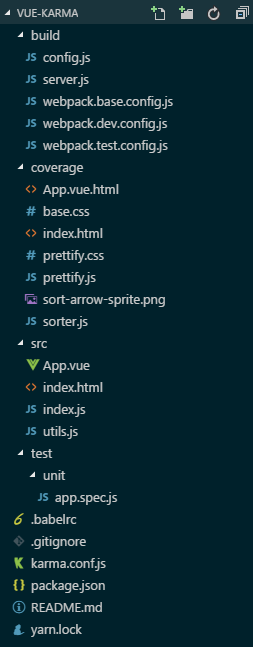

由于准备在项目中应用单元测试，于是先查文档完成了一个简单的测试demo

> Demo: [here](https://github.com/wxul/vue-karma)

karma是一个启动器，可以测试在浏览器中运行的代码，此处是配合PhantomJs启动无头浏览器；mocha是一个测试框架，但是本身并不带断言库；所以引用了chai当断言库，chai提供了多种断言语法，此处选用了expect。3者配合可以实现自动化测试

目录结构:


### 1. 正常搭建vue+webpack开发环境

如目录结构所示，新建build文件夹用于存放开发配置，src目录用户存放项目源码

### 2. 安装karma

> 个人喜欢安装项目依赖时用yarn，其余时候用npm

先全局安装: `npm install -g karma-cli`

然后再安装到项目中: `yarn add karma --dev`

再在项目的目录下运行karma初始化命令: `karma init`

部分选项可以用键盘tab键切换，第一步是选择测试框架，此处可以选择 `jasmine,mocha,qunit,nodeunit,nunit`，我选择了 `mocha`

第二步是是否使用 `Require.js`，此处选择不使用

第三步是选择测试的浏览器环境，可以选择 `Chrome,ChromeCanary,Firefox,Safari,PhantomJS,Opera,IE`，最方便的就是电脑上有什么浏览器就选什么浏览器，不过测试js和vue组件的话不需要界面，所以选择无界面浏览器工具 `PhantomJS`。选择 PhantomJS 的话需要本机安装 [PhantomJS 工具包](http://phantomjs.org/download.html)

第四步是测试文件位置，可以用匹配符，此处填写 `test/unit/**/*.spec.js` 表示在 `test/unit`下所有以`.spec.js`结尾的文件都是测试文件 (由于目录下没有文件，所以会报警告找不到文件)

第五步是排除文件配置，写法同上

第六步是是否开启监听，初步搭建的时候可以关闭

完毕后可以在项目根目录下看到 `karma.conf.js` 文件，刚才填写或选择的配置项都在里面，随时可以修改

### 3. 安装mocha+chai

正常安装 `yarn add mocha chai --dev`

安装karma扩展 `yarn add karma-mocha karma-webpack --dev`

安装PhantomJS启动 `yarn add karma-phantomjs-launcher --dev`

### 4. 配置

karma配合webpack使用，需要先写好webpack的配置文件，项目中存放在 `build/webpack.test.config.js`
``` javascript
'use strict';

const path = require('path');
const webpack = require('webpack');

module.exports = {
    entry: './src/index.js',
    module: {
        loaders: [
            {
                test: /\.js$/,
                exclude: /(node_modules|bower_components)/,
                loader: 'babel-loader'
            },
            {
                test: /\.vue$/,
                loader: 'vue-loader'
            }
        ]
    },
    resolve: {
        extensions: ['.js', '.vue'],
        alias: {
            vue$: 'vue/dist/vue.js',
            '@src': path.resolve(__dirname, '../src')
        }
    }
};
```

然后修改 `karma.conf.js`
``` javascript
const webpackConfig = require('./build/webpack.test.config');
```

再在配置里添加配置
``` javascript
webpack: webpackConfig,
webpackMiddleware: {
    noInfo: true
}
```
修改 `preprocessors` 配置用webpack处理
``` javascript
preprocessors: {
    'test/unit/**/*.spec.js': ['webpack']
}
```

### 5. 编写测试

在 `test/unit` 下新建测试文件 `app.spec.js`，vue的测试写法可以参考 [官方文档](https://cn.vuejs.org/v2/guide/unit-testing.html)

先看被测试的文件 `App.vue` 的内容
``` html
<template>
    <div class="app">msg:{{msg}}</div>
</template>
<script>
export default {
    data() {
        return {
            msg: 'this is message.'
        };
    },
    mounted() {
        this.msg = 'mounted!';
    },
    methods: {
        hello(w) {
            return 'hello' + w;
        }
    }
};
</script>
```

然后编写测试语句
``` javascript
import App from '@src/App.vue';
import Vue from 'vue';

var expect = require('chai').expect;

describe('app组件', () => {
    it('检查mounted', () => {
        expect(App.mounted).to.a('function');
    });
    it('检查data', () => {
        expect(App.data).to.a('function');
    });
    it('检查hello方法', () => {
        const vm = new Vue(App).$mount();
        expect(vm.hello).to.a('function');
        expect(vm.hello(' world!')).to.equal('hello world!');
    });
    it('检查初始msg字段', () => {
        expect(App.data).to.a('function');
        expect(App.data().msg).to.equal('this is message.');
    });
    it('检查msg字段', () => {
        const vm = new Vue(App).$mount();
        expect(vm.msg).to.equal('mounted!');
    });
    it('检查渲染实例', () => {
        const Ctor = Vue.extend(App);
        const vm = new Ctor().$mount();
        expect(vm.$el.textContent).to.equal('msg:this is message.');
    });
    it('检查渲染更新', done => {
        const vm = new Vue(App).$mount();
        vm.msg = 'message2';
        // 在状态改变后和断言 DOM 更新前等待一刻
        Vue.nextTick(() => {
            expect(vm.$el.textContent).to.equal('msg:message2');
            done();
        });
    });
});
```

### 6. 开启测试

在根目录下运行 `karma start` 开启测试服务器 (如果没有全局安装部分模块，可以使用 `./node_modules/.bin/karma start` 运行)

如果一切正常，再开一个命令窗口运行 `karma run` 就可以看到测试结果了

> 浏览器输入`http://localhost:9876`可以看到测试服务器的界面

### 7. 测试覆盖率报告

基于webpack2.0+，需要安装一些依赖 `yarn add karma-coverage karma-coverage-istanbul-reporter istanbul-instrumenter-loader --dev`

同时修改一下配置，`webpack.test.config.js`:
``` javascript
{
    test: /\.vue$/,
    loader: 'vue-loader',
    options: {
        loaders: {
            js: 'babel-loader'
        },
        postLoaders: {
            js: 'istanbul-instrumenter-loader?esModules=true'
        }
    }
}
```

`karma.conf.js` 中添加或修改配置:
``` javascript
coverageIstanbulReporter: {
    reports: ['text-summary', 'html'],
    fixWebpackSourcePaths: true
},
reporters: ['progress', 'coverage-istanbul']
```

然后按照步骤6运行，就会在根目录下生成 `coverage` 文件夹，打开 `index.html` 就能看到测试覆盖率报告了

> etc...